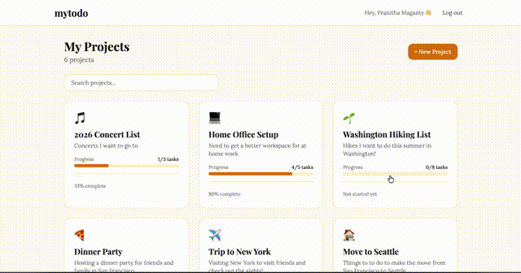

# mytodo

A personal task management app designed for everyday people. Think of it as a better version of your notes app, with a clean UI, project organization, and the ability to collaborate with others.



---

## Live Demo

| Service  | URL |
|----------|-----|
| Frontend | https://mytodo-iota-snowy.vercel.app |
| Backend API | https://mytodo-production-6b67.up.railway.app |

---

## Project Structure

```
mytodo/
  api/          → .NET 10 Web API (backend)
  client/       → React + TypeScript + Vite (frontend)
  api.tests/    → xUnit unit tests for the backend
```

See the individual READMEs for more detail:
- [`api/README.md`](./api/README.md) — backend architecture, API reference, and technical decisions
- [`client/README.md`](./client/README.md) — frontend architecture, features, and component structure

---

## Running Locally

### Prerequisites
- [.NET 10 SDK](https://dotnet.microsoft.com/download)
- [Node.js](https://nodejs.org) (v18+)

### Backend

```bash
cd api
dotnet restore
dotnet ef database update
dotnet run
```

API will be available at `http://localhost:5138`

### Frontend

```bash
cd client
npm install
npm run dev
```

App will be available at `http://localhost:5173`

### Running Tests

```bash
cd api.tests
dotnet test
```

---

## Tech Stack

| Layer | Technology |
|-------|-----------|
| Backend | .NET 10, ASP.NET Core Minimal API |
| Database | SQLite + Entity Framework Core |
| Frontend | React, TypeScript, Vite, Tailwind CSS |
| Auth | JWT (JSON Web Tokens) |
| Testing | xUnit, Moq, FluentAssertions |
| Deployment | Railway (API), Vercel (Frontend) |