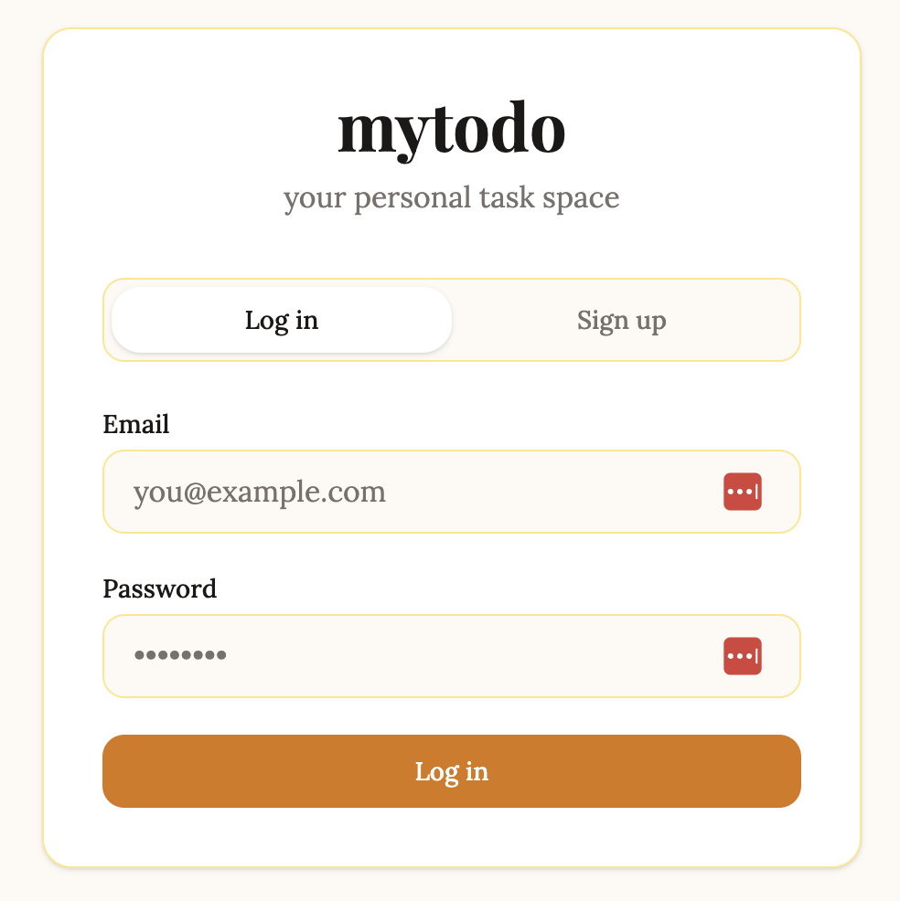
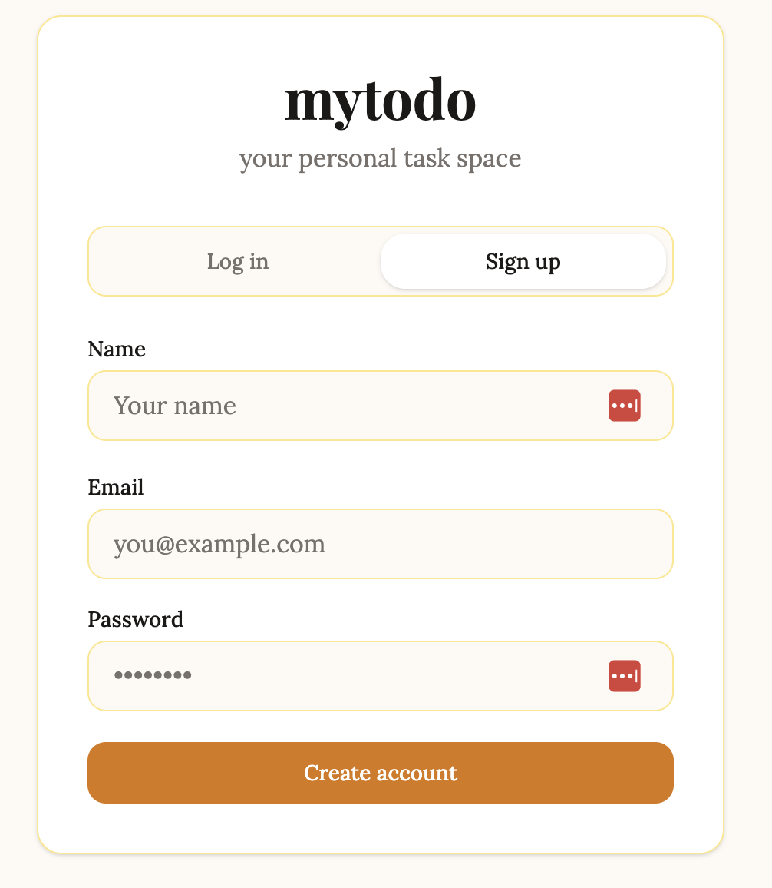

# mytodo — Frontend

A React + TypeScript frontend built for everyday people who want a simple, personal task management tool. Designed to feel warm and approachable — not like enterprise software.

---

## Table of Contents

- [Tech Stack & Why](#tech-stack--why)
- [Directory Structure](#directory-structure)
- [Pages](#pages)
- [Component Architecture](#component-architecture)
- [Design System](#design-system)
- [State Management](#state-management)
- [API Communication](#api-communication)
- [Authentication Flow](#authentication-flow)
- [Tradeoffs & Future Improvements](#tradeoffs--future-improvements)

---

## Tech Stack & Why

| Technology | Decision |
|------------|----------|
| **React** | Industry standard for component-based UIs. Required by the project spec. |
| **TypeScript** | Type safety catches bugs at compile time. All API responses have typed interfaces matching the backend response shapes. |
| **Vite** | Modern build tool replacing Create React App. Dramatically faster dev server startup and hot module replacement. The community standard for new React projects. |
| **Tailwind CSS v4** | Utility-first CSS framework. Enables rapid, consistent styling without writing separate CSS files. v4 uses a CSS-based theme configuration instead of `tailwind.config.js`. |
| **React Router** | Client-side routing for a multi-page SPA experience without full page reloads. |
| **Axios** | HTTP client with interceptor support. Used over native `fetch` specifically for its request interceptor — which automatically attaches the JWT token to every API call. |

---

## Directory Structure

```
client/src/
  components/
    comments/
      Comment.tsx           → Individual comment with inline edit and delete (author only)
      CommentList.tsx        → Comment thread with inline submit input
    layout/
      Navbar.tsx             → Top navigation bar with app title and logout
    projects/
      CreateProjectModal.tsx → Modal form for creating a new project
      EditProjectModal.tsx   → Modal form for editing an existing project (prepopulated)
      ProjectCard.tsx        → Dashboard project card with progress bar
      ProjectDetailCard.tsx  → Full project header with stats, edit/share/delete actions
      ProjectList.tsx        → Responsive grid of ProjectCards with empty state
      ShareProjectModal.tsx  → User search and member management for project sharing
    tasks/
      CreateTaskModal.tsx    → Modal form for creating a new task
      TaskDetailCard.tsx     → Full task view with inline editing (creator only)
      TaskFilters.tsx        → Multi-select filter pills for status, priority, created by
      TaskList.tsx           → Task table with collapsible filters and sortable columns
      TaskRow.tsx            → Single task row with quick-complete checkbox
    ui/
      Button.tsx             → Reusable button with variant and size props
      Card.tsx               → Reusable card container with optional hover state
      ConfirmModal.tsx       → Reusable confirmation dialog for destructive actions
      Input.tsx              → Reusable input supporting text, email, password, date, textarea
      Modal.tsx              → Reusable modal with backdrop click and Escape key to close
    ProtectedRoute.tsx       → Route wrapper that redirects unauthenticated users to login
  context/
    AuthContext.tsx           → Global auth state — user, token, login, logout
  pages/
    DashboardPage.tsx         → Project list with search
    LoginPage.tsx             → Login and register (toggled on same page)
    ProjectPage.tsx           → Project detail with tasks, comments, members
    TaskPage.tsx              → Task detail with comments
  services/
    api.ts                    → Configured Axios instance with auth interceptor
  types/
    index.ts                  → TypeScript interfaces matching backend response shapes
  App.tsx                     → Route definitions
  main.tsx                    → App entry point with providers
  index.css                   → Tailwind imports and design token definitions
```

---

## Pages

### Login Page (`/login`)


Single page that handles both login and registration via a toggle. No separate `/register` route — toggling between the two forms on the same page keeps the UX simple and avoids unnecessary navigation.


**Key decisions:**
- Combined login/register on one page reduces friction for new users
- 1Password and other password managers auto-detect the form because we use semantic HTML input types (`type="email"`, `type="password"`)
- Error messages are shown inline below the form

---

### Dashboard Page (`/`)
[add screenshot here]

The main page after login. Shows all projects the user owns or has been shared with, in a responsive card grid ordered by most recently created.

**Key decisions:**
- Search bar on the right filters projects by title via a backend API call with 300ms debounce — no client-side filtering
- Project cards show a progress bar (completed tasks / total tasks) so users can see project health at a glance
- Empty state has personality: guides the user to create their first project
- "New Project" button opens a modal — keeps the user in context rather than navigating away

---

### Project Page (`/projects/:id`)
[add screenshot here]

The project detail page. Shows project info, all tasks in a table, and project-level comments.

**Key decisions:**
- Tasks displayed as a table rather than cards — tables are better for comparing multiple attributes (status, priority, due date) across many items
- Filters are collapsible to save space — a badge shows how many filters are active even when collapsed
- Column headers are clickable to sort — standard table UX pattern users expect
- Quick-complete checkbox on each task row — most common action shouldn't require opening the task
- Edit/Share/Delete buttons only shown to the project owner — members see a read-only header
- Comments use an inline input (Enter to submit) rather than a modal — feels more like a chat, lower friction

---

### Task Page (`/tasks/:id`)
[add screenshot here]

The task detail page. Shows all task fields and task-level comments.

**Key decisions:**
- Fields are inline editable for the task creator — clicking a field makes it editable, blur saves automatically. No separate edit mode needed.
- Non-creators see a read-only view — the same component renders differently based on `isOwner` prop
- Status and priority use pill buttons rather than dropdowns — faster to interact with, visually clear
- Metadata section at the bottom shows created by, created date, completed by, and completed date
- Delete button opens a confirmation modal — destructive actions should require intentional confirmation

---

## Component Architecture

### Design Principles

**Build what you need, when you need it.** Components were created as each page required them — no speculative components built in advance. This kept the codebase lean.

**Pages compose components, not the other way around.** Pages own state and pass data down. Components are stateless where possible and receive everything they need via props.

**UI components are generic, feature components are specific.** The `ui/` folder contains truly reusable primitives (Button, Input, Modal, Card). The `projects/`, `tasks/`, and `comments/` folders contain feature-specific components that know about the domain.

### Component Hierarchy

```
App
├── LoginPage
│   ├── Input
│   └── Button
├── DashboardPage (protected)
│   ├── Navbar
│   ├── ProjectList
│   │   └── ProjectCard
│   └── CreateProjectModal
│       ├── Modal
│       ├── Input
│       └── Button
├── ProjectPage (protected)
│   ├── Navbar
│   ├── ProjectDetailCard
│   │   ├── EditProjectModal
│   │   │   ├── Modal
│   │   │   ├── Input
│   │   │   └── Button
│   │   ├── ShareProjectModal
│   │   │   ├── Modal
│   │   │   └── Button
│   │   └── ConfirmModal
│   ├── TaskList
│   │   ├── TaskFilters
│   │   └── TaskRow
│   ├── CreateTaskModal
│   │   ├── Modal
│   │   ├── Input
│   │   └── Button
│   └── CommentList
│       └── Comment
└── TaskPage (protected)
    ├── Navbar
    ├── TaskDetailCard
    │   └── ConfirmModal
    └── CommentList
        └── Comment
```

### Reusable UI Components

**`Button`** — accepts `variant` (primary, secondary, ghost, danger), `size` (sm, md, lg), and `fullWidth`. All button styles are defined once here. Changing a variant updates every button using it across the app.

**`Input`** — accepts `type` (text, email, password, date, textarea) and optional `onBlur` for auto-save behavior. Handles its own error display.

**`Modal`** — base modal with backdrop click and Escape key to dismiss. All modals in the app (`CreateProjectModal`, `EditProjectModal`, `ConfirmModal` etc.) compose this base component rather than reimplementing modal behavior.

**`ConfirmModal`** — wraps `Modal` with a standard "are you sure?" pattern. Used for both project and task deletion. Reusable for any future destructive action.

**`Card`** — base card container with optional `hoverable` prop for clickable cards.

---

## Design System

Design tokens are defined in `index.css` using Tailwind v4's `@theme` directive. All colors, fonts, and spacing reference these tokens — no hardcoded color values scattered through components.

### Color Palette

```css
brand-bg          → #FDFAF5  (warm cream page background)
brand-paper       → #FFFFFF  (card/modal backgrounds)
brand-primary     → #D97706  (amber — primary actions, active states)
brand-secondary   → #FEF3C7  (light amber — hover states, filter backgrounds)
brand-border      → #FDE68A  (warm yellow borders)
brand-text        → #1C1917  (near-black body text)
brand-text-light  → #78716C  (muted secondary text)
brand-error       → #DC2626  (red — errors, danger buttons)
brand-success     → #16A34A  (green — success states)
```

### Priority Colors
```css
priority-low      → #86EFAC  (green)
priority-medium   → #FCD34D  (yellow)
priority-high     → #FCA5A5  (light red)
priority-urgent   → #F87171  (red)
```

### Status Colors
```css
status-todo       → #E5E7EB  (grey)
status-in-progress → #BFDBFE (blue)
status-done       → #BBF7D0  (green)
```

### Typography

```css
font-sans         → Lora (serif body font — warm, readable)
font-display      → Playfair Display (serif display font — headings and titles)
font-mono         → JetBrains Mono (monospace — code if needed)
```

**Why serif fonts?** The app targets everyday personal use — not enterprise software. Serif fonts feel warmer and more personal than the Inter/system-font defaults common in SaaS apps. The goal was an aesthetic closer to a well-designed notebook than a project management tool.

---

## State Management

No external state management library (Redux, Zustand etc.) is used. State lives at the appropriate level:

**Global state** — Auth state (current user, token) lives in `AuthContext` and is accessible anywhere via `useAuth()`. This is the only truly global state in the app.

**Page-level state** — Each page owns its own data fetching and state. `ProjectPage` owns the project, tasks, comments, and members. It passes data down to child components and receives updates via callback props.

**Component-level state** — UI state like modal open/closed, loading states, and form inputs live in the component that uses them.

This approach keeps state as local as possible — a React best practice that makes components easier to reason about and test.

---

## API Communication

All API calls go through a single configured Axios instance in `services/api.ts`.

### Request Interceptor
Automatically attaches the JWT token to every request:
```typescript
api.interceptors.request.use((config) => {
  const token = localStorage.getItem("token");
  if (token) config.headers.Authorization = `Bearer ${token}`;
  return config;
});
```
This means no individual API call needs to think about authentication — it just happens.

### Response Interceptor
Handles expired or invalid tokens globally:
```typescript
api.interceptors.response.use(
  (response) => response,
  (error) => {
    if (error.response?.status === 401) {
      localStorage.removeItem("token");
      window.location.href = "/login";
    }
    return Promise.reject(error);
  }
);
```
If any request returns 401, the user is automatically logged out and redirected to login.

### Base URL
Reads from the `VITE_API_URL` environment variable in production, falls back to `http://localhost:5138` for local development.

---

## Authentication Flow

1. User submits login or register form on `LoginPage`
2. `AuthService.login()` or `AuthService.register()` is called on the API
3. On success, `login(token, user)` is called from `AuthContext`
4. Token and user are stored in `localStorage` and React state
5. User is redirected to `/` (dashboard)
6. On every subsequent page load, `AuthContext` reads from `localStorage` to restore session
7. `ProtectedRoute` checks `AuthContext` — if no user, redirects to `/login`
8. On logout, `localStorage` is cleared and user is redirected to `/login`

---

## Tradeoffs & Future Improvements

### No Frontend Testing
Unit tests were not written for the React components. The backend has 27 unit tests covering the most critical authorization and business logic paths. Frontend component testing (React Testing Library) and end-to-end testing (Playwright/Cypress) would be the next step for a production application. The decision to skip frontend testing for this MVP was made to prioritize backend correctness, logging, and deployment.

### localStorage for Token Storage
JWTs are stored in `localStorage` for simplicity. The alternative is `httpOnly` cookies which are not accessible to JavaScript and therefore immune to XSS attacks. For a production app, `httpOnly` cookies would be the more secure choice.

### No Optimistic Updates
Most UI updates wait for the API response before updating state. Optimistic updates (updating the UI immediately and rolling back on failure) would make the app feel snappier, particularly for task completion toggling.

### No Pagination
Task and comment lists fetch all records. For projects with many tasks, infinite scroll or pagination would be needed. The backend already supports this pattern — adding `.Skip()` and `.Take()` to the repository queries would be straightforward.

### No Offline Support
The app requires an internet connection. A service worker with offline caching would allow read-only access when offline, with changes synced when connection is restored.

### Cover Image & Avatar Support
`Project.coverImageUrl` and `User.avatarUrl` fields exist on the backend models but are not exposed in the UI. Implementing this requires file upload infrastructure (AWS S3 or Cloudflare R2). The data model is already in place — no migration needed.

### Task Types
The `type` field exists on `TodoTask` but is not currently used. The planned implementation would let users categorize tasks (Errand, Finance, Personal, Health etc.) with filtering support already built into the backend filter system.

### Real-time Updates
Currently users need to refresh to see changes made by other project members. WebSockets (SignalR in .NET) would enable real-time collaboration — changes appear instantly for all project members.